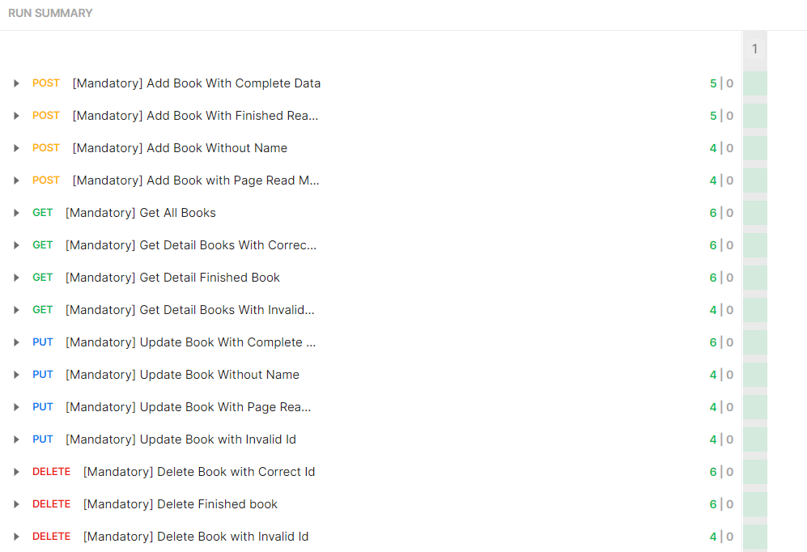

# BOOKSHELF APP API

Project ini merupakan submission Dicoding kelas Backend Pemula. Kelas ini mempelajari cara membangun RESTful API, dari HTTP server, routing, penggunaan Framework Hapi,mempelajari dasar penggunaan Postman, serta membangun Back-End untuk aplikasi yang nyata

### KRITERIA PENILAIAN

- [x] API dapat menyimpan buku
- [x] API dapat menampilkan seluruh buku
- [x] API dapat menampilkan detail buku
- [x] API dapat mengubah data buku
- [x] API dapat menghapus buku
- [x] Project menggunakan port 9000
- [x] Project memiliki runner scripts dengan nama start

### RESULT

